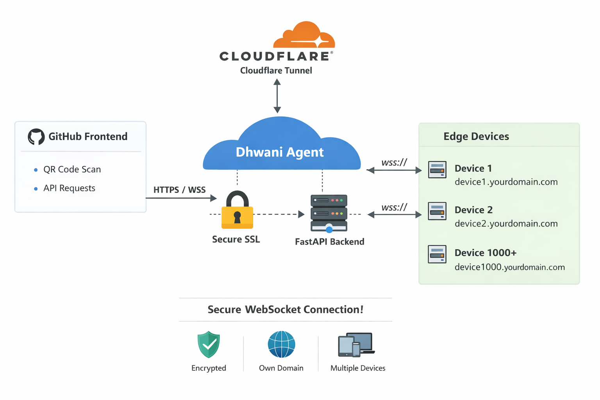

# Edge Device Controller

A FastAPI-based edge device controller with Cloudflare tunnel integration for secure remote access and WebSocket communication.



## 📋 Features

- **Cloudflare Tunnel**: Exposes local server to the internet securely
- **WebSocket Support**: Real-time communication with connected devices
- **QR Code Generation**: Device connection via QR codes
- **Automatic Tunnel Setup**: Cloudflare tunnel starts automatically

---

## 🛠️ Prerequisites

- **Python 3.8+** - [Download Python](https://www.python.org/downloads/)
- **pip** - Python package manager (included with Python)
- **Cloudflared** - Cloudflare Tunnel client
- **Git** (optional) - [Download Git](https://git-scm.com/)

---

## 📦 Installation & Setup

### Step 1: Install Python Dependencies

```bash
pip install fastapi uvicorn websockets qrcode python-multipart pillow requests
```

**Required Packages:**
- `fastapi` - Web framework
- `uvicorn` - ASGI server
- `websockets` - WebSocket support
- `qrcode` - QR code generation
- `pillow` - Image processing
- `requests` - HTTP requests

### Step 2: Install Cloudflare Tunnel (Cloudflared)

#### **For Windows:**

**Option 1: Using Pre-built Binary (Recommended)**
1. Download from: https://github.com/cloudflare/cloudflared/releases
2. Download `cloudflared-windows-amd64.exe` (for 64-bit) or `cloudflared-windows-386.exe` (for 32-bit)
3. Rename to `cloudflared.exe`
4. Place in `C:\Windows\System32` or add to PATH

**Option 2: Using Chocolatey (if installed)**
```bash
choco install cloudflare-warp
```

**Option 3: Using Scoop (if installed)**
```bash
scoop install cloudflared
```

**Verify Installation:**
```bash
cloudflared --version
```

#### **For macOS:**

```bash
brew install cloudflare/cloudflare/cloudflared
```

#### **For Linux (Ubuntu/Debian):**

```bash
curl -L https://github.com/cloudflare/cloudflared/releases/latest/download/cloudflared-linux-amd64.tgz | tar xz
sudo cp ./cloudflared /usr/bin/cloudflared
sudo chmod +x /usr/bin/cloudflared
```

---

## 🚀 Quick Start

### Running the Application

#### **Option 1: Local Server Only** (For local network access)

```bash
python other-scripts/server.py
```

- Server runs on: `http://localhost:8000`
- Access the QR code at: `http://<your-local-ip>:8000`
- WebSocket URL: `ws://<your-local-ip>:8000/ws`

#### **Option 2: With Cloudflare Tunnel** (For internet access)

```bash
python main.py
```

- Automatically starts Cloudflare tunnel
- Exposes the server publicly
- WebSocket accessible via tunnel URL (e.g., `wss://xxxxxx.trycloudflare.com/ws`)

---

## 📡 Cloudflare Tunnel Setup (Step by Step)

### What is Cloudflare Tunnel?

Cloudflare Tunnel (also called Zero Trust tunnels) creates a secure, encrypted tunnel from your device to Cloudflare without needing to expose ports or configure firewalls.

### Manual Tunnel Setup (Advanced)

If you prefer to set up a persistent tunnel instead of the ephemeral `trycloudflare.com`:

1. **Authenticate with Cloudflare:**
   ```bash
   cloudflared tunnel login
   ```
   - Opens browser to Cloudflare dashboard
   - Select your domain
   - Download certificate

2. **Create Named Tunnel:**
   ```bash
   cloudflared tunnel create my-edge-device
   ```

3. **Configure Tunnel** (`~/.cloudflared/config.yml`):
   ```yaml
   tunnel: my-edge-device
   credentials-file: ~/.cloudflared/<TUNNEL_ID>.json

   ingress:
     - hostname: device.yourdomain.com
       service: http://localhost:8000
       websocket: true
     - service: http_status:404
   ```

4. **Run Named Tunnel:**
   ```bash
   cloudflared tunnel run my-edge-device
   ```

---

## 📁 Project Structure

```
edge-device-controller/
├── main.py                    # Cloudflare tunnel + WebSocket server
├── other-scripts/
│   └── server.py             # Local WebSocket server with QR code
├── README.md                 # This file
├── requirements.txt          # Python dependencies
└── __pycache__/             # Python cache (auto-generated)
```

---

## 💾 Create requirements.txt

```bash
pip freeze > requirements.txt
```

**requirements.txt content:**
```
fastapi==0.104.1
uvicorn==0.24.0
websockets==12.0
qrcode==7.4.2
pillow==10.1.0
requests==2.31.0
python-multipart==0.0.6
Werkzeug==3.0.0
```

---

## 🔧 Configuration

### Environment Variables (Optional)

Create a `.env` file for custom configuration:

```bash
# .env
HOST=0.0.0.0
PORT=8000
LOG_LEVEL=info
TUNNEL_PROTOCOL=http
```

Load in Python:
```python
from dotenv import load_dotenv
import os

load_dotenv()
HOST = os.getenv("HOST", "0.0.0.0")
PORT = int(os.getenv("PORT", 8000))
```

---

## 🌐 Testing WebSocket Connection

### Using Python:
```python
import asyncio
import websockets
import json

async def test_ws():
    # Replace with your tunnel URL or local IP
    uri = "wss://xxxxxx.trycloudflare.com/ws"  # or ws://localhost:8000/ws
    
    async with websockets.connect(uri) as websocket:
        await websocket.send(json.dumps({"message": "Hello Device"}))
        response = await websocket.recv()
        print(f"Received: {response}")

asyncio.run(test_ws())
```

### Using JavaScript (Browser Console):
```javascript
const ws = new WebSocket("wss://xxxxxx.trycloudflare.com/ws");

ws.onopen = () => {
    console.log("Connected!");
    ws.send(JSON.stringify({message: "Hello from browser"}));
};

ws.onmessage = (event) => {
    console.log("Received:", event.data);
};
```

---

## 🔐 Security Best Practices

1. **Use Named Tunnels**: Don't rely on ephemeral `trycloudflare.com` URLs in production
2. **Enable Cloudflare Analytics**: Monitor tunnel usage in dashboard
3. **Set IP Restrictions**: Use Cloudflare rules to allow specific IPs only
4. **Use HTTPS/WSS**: Always encrypt traffic
5. **Rotate Credentials**: Regularly update tunnel authentication

---

## 🐛 Troubleshooting

### Issue: `cloudflared command not found`
**Solution**: Download from [GitHub releases](https://github.com/cloudflare/cloudflared/releases) and add to PATH

### Issue: `ModuleNotFoundError: No module named 'fastapi'`
**Solution**: Install dependencies
```bash
pip install -r requirements.txt
```

### Issue: Port 8000 already in use
**Solution**: Use a different port
```bash
python -m uvicorn main:app --port 8001
```

### Issue: Tunnel not starting
**Solution**: 
- Check cloudflared is installed: `cloudflared --version`
- Ensure port 8000 is not blocked by firewall
- Check internet connection

---

## 📚 Useful Links

- **FastAPI Documentation**: https://fastapi.tiangolo.com/
- **Cloudflare Tunnel Docs**: https://developers.cloudflare.com/cloudflare-one/connections/connect-applications/
- **Cloudflared GitHub Releases**: https://github.com/cloudflare/cloudflared/releases
- **Cloudflare Dashboard**: https://dash.cloudflare.com/
- **WebSocket Documentation**: https://websockets.readthedocs.io/

---

## 📝 License

MIT License - Feel free to use and modify

---

## 🤝 Support

For issues or questions:
1. Check the Troubleshooting section
2. Review [Cloudflare Docs](https://developers.cloudflare.com/)
3. Check [FastAPI Docs](https://fastapi.tiangolo.com/)

---

**Last Updated**: February 2026
